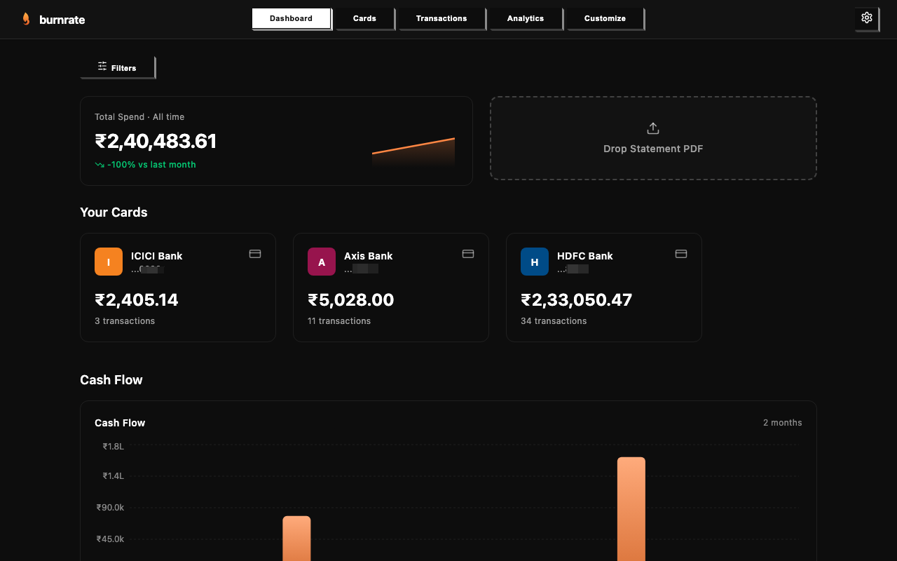
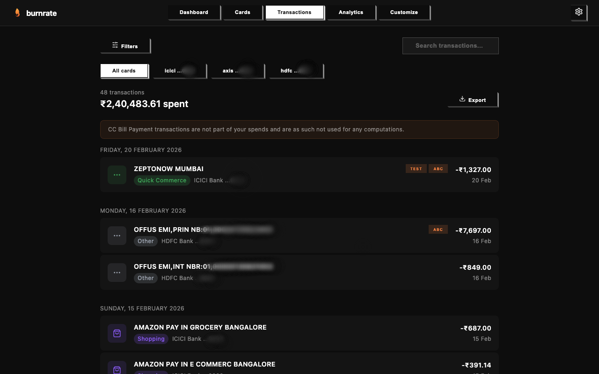
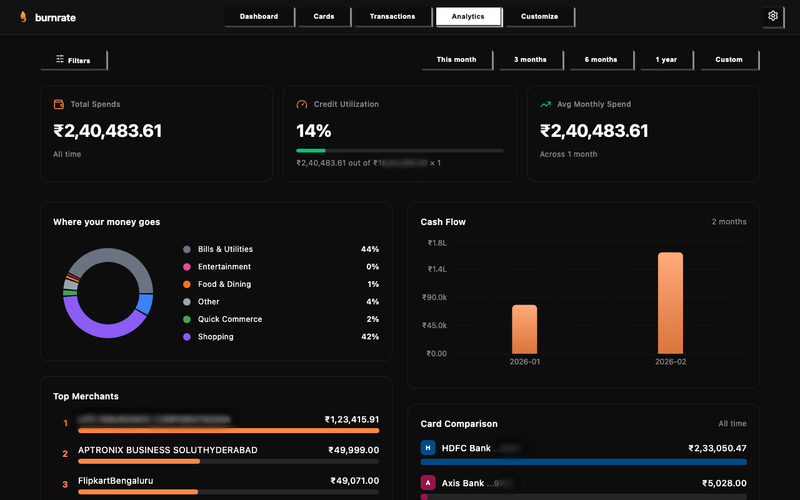
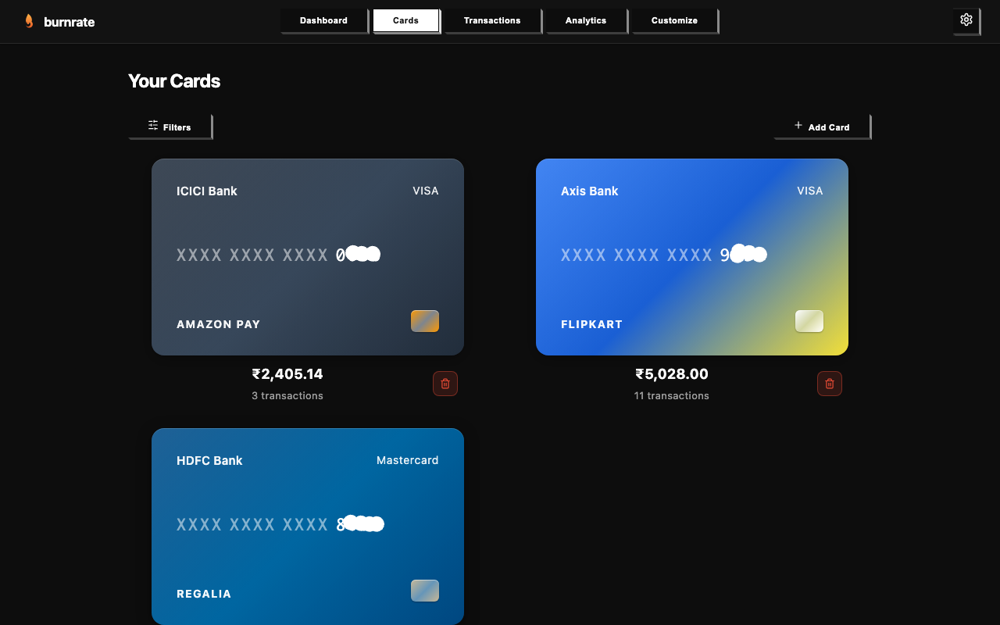
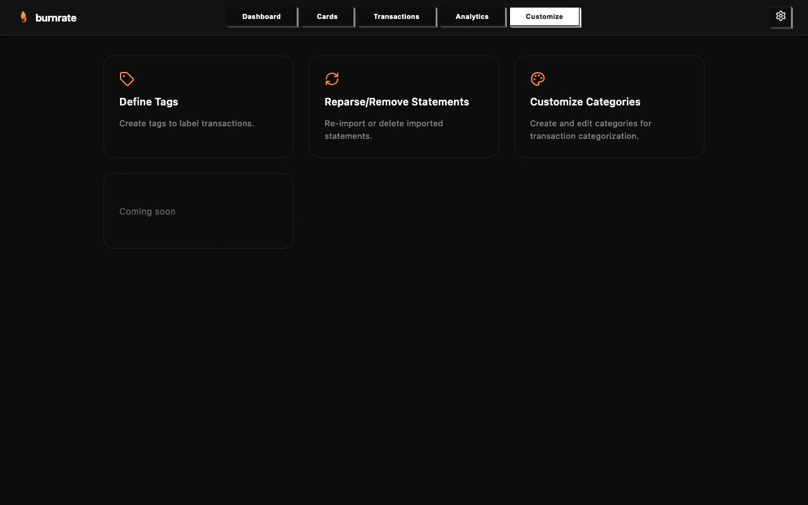
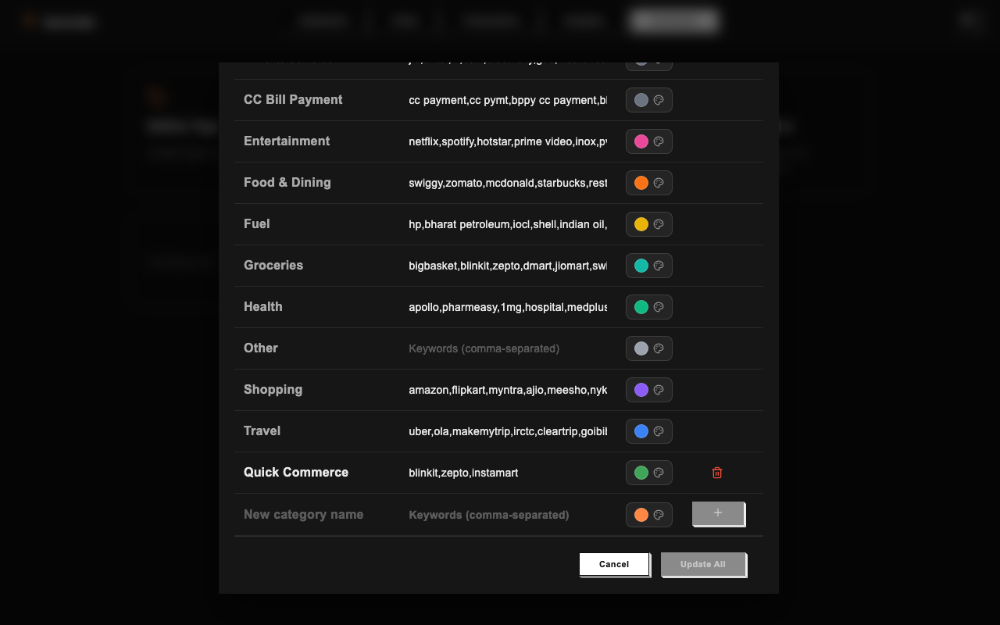

# Burnrate

**Privacy-first, local-only credit card spend analytics.**

Burnrate is a personal finance analytics app that runs entirely on your laptop. Your financial data never leaves your machine — no cloud, no servers, no tracking.



## Features

- **Multi-bank support** — HDFC, ICICI, Axis, SBI, Amex, IDFC FIRST, IndusInd, Kotak, Standard Chartered, YES, AU, RBL
- **Auto-import** — Drop PDF statements or set up a watch folder for automatic processing
- **Smart categorization** — Transactions auto-categorized with customizable categories and keywords
- **Rich analytics** — Spend trends, category breakdowns, merchant insights, credit utilization
- **Multi-card filtering** — Filter by cards, categories, date range, amount, direction, and tags
- **Transaction tagging** — Define and apply custom tags to transactions
- **CSV export** — Export filtered transactions for external analysis
- **Statement management** — Reparse or remove imported statements
- **Google Apps Script** — Auto-download statements from Gmail (optional)

## Privacy First

- All data stored locally in SQLite
- No network requests to external services
- No telemetry, analytics, or tracking
- Your statements and transactions stay on your machine

## Tech Stack

| Layer | Technology |
|-------|-----------|
| Backend | Python 3.11+, FastAPI, SQLAlchemy, SQLite |
| Frontend | React 18, TypeScript, Vite, styled-components |
| Design | NeoPOP by CRED (@cred/neopop-web) |
| PDF Processing | pikepdf, pdfplumber |
| Auto-import | watchdog (folder watcher) |

## Quick Start

### Prerequisites

- Python 3.11+
- Node.js 18+
- npm

### Backend

```bash
cd backend
python -m venv venv
source venv/bin/activate  # On Windows: venv\Scripts\activate
pip install -r requirements.txt
cd ..
python -m uvicorn backend.main:app --host 0.0.0.0 --port 8000
```

### Frontend

```bash
cd frontend-neopop
npm install
npm run dev
```

Open http://localhost:5173 in your browser.

### First Run

1. Complete the setup wizard (name, DOB, cards)
2. Set a watch folder or drag-and-drop statement PDFs
3. Explore your spend analytics

## Screenshots

| Dashboard | Transactions |
|-----------|-------------|
|  |  |

| Analytics | Cards |
|-----------|-------|
|  |  |

| Customize | Categories |
|-----------|-----------|
|  |  |

## Project Structure

```
burnrate/
├── backend/              # FastAPI backend
│   ├── main.py           # App entry point
│   ├── config.py         # Bank configs & categories
│   ├── models/           # SQLAlchemy models
│   ├── routers/          # API endpoints
│   ├── services/         # Business logic
│   └── data/             # SQLite DB & uploads
├── frontend-neopop/      # React frontend
│   ├── src/
│   │   ├── pages/        # Page components
│   │   ├── components/   # Shared components
│   │   ├── contexts/     # React contexts
│   │   ├── hooks/        # Custom hooks
│   │   └── lib/          # Types, utils, API
│   └── public/
├── apps-script/          # Gmail auto-download (optional)
└── screenshots/          # App screenshots
```

## Distribution

Potential approaches under consideration:

- **Electron** — Package as a native desktop app with embedded Python backend. Self-contained, familiar to users.
- **Docker** — Single `docker-compose up` for both frontend and backend. Easy for technical users.
- **Tauri** — Lightweight native wrapper (Rust-based). Smaller bundle than Electron.
- **PyInstaller + static build** — Bundle the Python backend as a standalone executable, serve the pre-built React frontend from it. No Node.js needed at runtime.
- **Homebrew formula** — For macOS users: `brew install burnrate`.

The recommended path is **PyInstaller + static build** for simplicity — a single binary that starts both the backend and serves the frontend, with zero dependencies for end users.

## License

Private — not open source.
